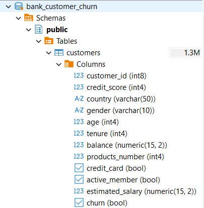
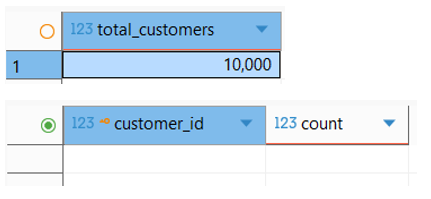

# Bank Customer Churn Analysis

A comprehensive banking analytics project that investigates the key factors influencing customer churn using **PostgreSQL, SQL, and Python**. The project follows an end-to-end analytics workflow, including database design, data quality validation, SQL-based business analysis, exploratory data analysis (EDA), statistical analysis, data visualisation, and business interpretation to transform raw customer data into actionable business insights and recommendations.

## Business Problem

Customer churn is one of the most significant challenges faced by financial institutions, as retaining existing customers is considerably more cost-effective than acquiring new ones. Identifying the characteristics and behaviours associated with customer attrition enables banks to implement targeted retention strategies, improve customer satisfaction, and minimise revenue loss.

This project analyses customer demographics, banking behaviour, and account characteristics to identify the key drivers of customer churn and provide data-driven recommendations for improving customer retention.

## Project Objectives

The objectives of this project are to:

* Assess the quality of the dataset through comprehensive data cleaning and validation.
* Perform exploratory data analysis (EDA) to understand customer characteristics.
* Analyse the relationships between customer attributes and churn.
* Identify the key factors associated with customer retention.
* Provide business insights supported by statistical analysis and data visualisations.
* Develop practical business recommendations based on analytical findings.
* Demonstrate end-to-end banking analytics skills using PostgreSQL, SQL, and Python.

## Dataset

This project uses the **Bank Customer Churn Prediction** dataset containing **10,000 customer records** and **12 variables** describing customer demographics, banking products, account information, and churn status.

**Source:** Kaggle – Bank Customer Churn Prediction Dataset.

### Variables

* Customer ID
* Credit Score
* Country
* Gender
* Age
* Tenure
* Account Balance
* Number of Products
* Credit Card Ownership
* Active Member Status
* Estimated Salary
* Customer Churn

## Technologies Used

- PostgreSQL
- SQL
- DBeaver
- Python
- Pandas
- Matplotlib
- Git
- GitHub
- Visual Studio Code

## Installation

Clone the repository:

```bash
git clone https://github.com/AbdulMoizAnwer/Bank-Customer-Churn-Analysis.git
```

Navigate to the project directory:

```bash
cd Bank-Customer-Churn-Analysis
```

Before running this project, install:

- PostgreSQL 17 or later
- DBeaver (or another PostgreSQL client)
- Python 3.12 or later

Install the required Python libraries:

```bash
pip install -r requirements.txt
```

Open the SQL scripts using DBeaver (or any PostgreSQL client) and execute them in the following order:

1. `01_schema.sql`
2. `02_data_validation.sql`
3. `03_business_queries.sql`

Run the Python analysis:

```bash
python python/churn_analysis.py
```

## Project Structure

```text
Bank-Customer-Churn-Analysis/
│
├── data/
│   └── Bank Customer Churn Prediction.csv
│
├── images/
│   ├── Univariate Analysis/
│   │   ├── activity_status.png
│   │   ├── age_distribution.png
│   │   ├── country_distribution.png
│   │   └── products_distribution.png
│   │
│   ├── Bivariate Analysis/
│   │   ├── active_member_vs_churn.png
│   │   ├── age_vs_churn.png
│   │   ├── balance_vs_churn.png
│   │   ├── correlation_heatmap.png
│   │   ├── country_vs_churn.png
│   │   ├── credit_card_vs_churn.png
│   │   ├── credit_score_vs_churn.png
│   │   ├── products_vs_churn.png
│   │   ├── salary_vs_churn.png
│   │   └── tenure_vs_churn.png
│   │
│   └── SQL/
│       ├── 01_database_schema.png
│       ├── 02_customer_table.png
│       ├── 03_country_churn_analysis.png
│       ├── 04_products_churn_analysis.png
│       ├── 05_data_validation.png
│       └── 06_sql_query_example.png
│
├── python/
│   └── churn_analysis.py
│
├── sql/
│   ├── 01_schema.sql
│   ├── 02_data_validation.sql
│   └── 03_business_queries.sql
│
├── README.md
├── requirements.txt
└── .gitignore
```

## Project Workflow

The project follows an end-to-end banking analytics workflow:

```text
Bank Customer Churn Dataset
            │
            ▼
Data Quality Assessment
            │
            ▼
PostgreSQL Database Design
            │
            ▼
SQL Business Analysis
            │
            ▼
Python Exploratory Data Analysis
            │
            ▼
Business Insights
            │
            ▼
Business Recommendations
```

## Data Cleaning & Data Quality Assessment

The following data quality checks were performed before conducting the analysis:

* Missing value analysis
* Duplicate record detection
* Data type validation
* Category consistency checks
* Impossible value detection
* Outlier detection using Boxplots and the Interquartile Range (IQR) method
* Correlation analysis of numerical variables

No missing values, duplicate records, or significant data quality issues were identified. Therefore, the dataset was considered suitable for further analysis without requiring major preprocessing.

## Exploratory Data Analysis (EDA)

### Univariate Analysis

The following variables were analysed individually:

* Customer distribution by country
* Customer distribution by gender
* Age distribution
* Banking products distribution
* Active member status
* Credit card ownership
* Customer churn distribution

### Bivariate Analysis

Customer churn was analysed against:

* Country
* Gender
* Age
* Credit Score
* Account Balance
* Estimated Salary
* Number of Banking Products
* Active Member Status
* Credit Card Ownership
* Tenure

Each analysis includes statistical interpretation, business insights, and practical recommendations.

## PostgreSQL Business Analysis

In addition to the Python-based exploratory analysis, this project includes a complete PostgreSQL implementation to demonstrate practical SQL skills used in banking and financial analytics.

The SQL workflow consists of:

- Database schema design
- Customer table creation
- Data import into PostgreSQL
- Data quality validation
- Business-oriented SQL analysis
- Customer segmentation
- Churn analysis
- Retention-focused business insights

The SQL scripts included in this repository demonstrate how relational databases can be used to answer real business questions commonly encountered by data analysts working in banking, fintech, and financial services.

### Database Schema

The customer dataset was imported into PostgreSQL after designing a relational table schema with appropriate data types and constraints.

The `customer_id` column was defined as the primary key to ensure every customer record is unique and to prevent duplicate entries during data import.



---

### SQL Analysis – Customer Churn by Country

The following SQL query calculates the churn rate for each country using aggregation, conditional filtering, and percentage calculations.


---

### Data Validation

Before performing the business analysis, the imported dataset was validated to confirm:

- 10,000 customer records were imported successfully.
- No duplicate customer IDs were found.
- Data integrity was maintained after import.



## Featured Visualizations

The following visualisations highlight some of the most important findings from the exploratory data analysis. Each chart provides insight into the factors associated with customer churn and supports the business recommendations presented in this project.

### Customer Churn by Country

Germany recorded the highest customer churn rate (32.4%), almost double that of France and Spain. This suggests that customer retention challenges are more pronounced in the German market and may require targeted investigation and retention strategies.


### Customer Age vs Customer Churn

The analysis indicates that older customers are more likely to leave the bank than younger customers. This finding suggests that age is an important demographic factor associated with customer churn and should be considered when designing customer retention initiatives.


### Customer Activity vs Customer Churn

Inactive customers exhibited nearly twice the churn rate of active customers. This highlights customer engagement as one of the strongest behavioural indicators of customer retention and emphasises the importance of encouraging regular account activity.


### Number of Banking Products vs Customer Churn

Customers holding two banking products demonstrated the highest retention rates, while customers with only one product were considerably more likely to churn. This suggests that strengthening customer relationships through appropriate cross-selling may improve long-term customer loyalty.


### Correlation Matrix

The correlation analysis confirms that customer age and activity status exhibit the strongest relationships with churn, while variables such as estimated salary, credit card ownership, tenure, and credit score show relatively weak individual associations. These findings support the conclusions obtained from the exploratory data analysis.


## Key Business Insights

The analysis produced several important business findings:

* Germany recorded the highest customer churn rate among the three countries analysed.
* Older customers demonstrated a greater tendency to leave the bank.
* Inactive customers were significantly more likely to churn than active customers.
* Customers holding two banking products exhibited the highest customer retention.
* Customers with higher account balances appeared more frequently in the churned group, highlighting the importance of retaining high-value customers.
* Estimated salary, credit card ownership, and tenure showed relatively weak relationships with customer churn.
* Correlation analysis confirmed that age and customer activity were among the strongest variables associated with customer churn.

## SQL Business Questions

The SQL analysis answers several business-focused questions, including:

- How many customers churned and how many remained?
- What is the overall customer churn rate?
- Which country has the highest churn rate?
- Are inactive customers more likely to churn?
- How does the number of banking products relate to customer retention?
- How do churned customers differ from retained customers?
- Which high-value customers may require proactive retention strategies?

Each SQL query includes business interpretation rather than only technical output, reflecting the type of analysis expected in banking and financial analytics roles.

## Skills Demonstrated

This project demonstrates practical skills in:

- PostgreSQL database design
- SQL data validation
- Business-oriented SQL analysis
- Customer churn analysis
- Exploratory Data Analysis (EDA)
- Banking analytics
- Data visualization
- Business interpretation
- Git and GitHub version control

## Business Recommendations

Based on the analytical findings, the following recommendations are proposed:

* Prioritise retention initiatives targeting inactive customers.
* Develop customer engagement programmes specifically designed for older customer segments.
* Encourage appropriate cross-selling strategies to strengthen customer relationships.
* Implement proactive monitoring of high-balance customers to minimise the loss of valuable deposits.
* Focus predictive churn models on behavioural variables such as customer activity, product ownership, age, and account balance rather than relying solely on demographic characteristics.

## Business Value

The findings of this analysis can help financial institutions:

- Identify customers at high risk of churn.
- Improve customer retention strategies.
- Support data-driven decision-making.
- Prioritise high-value customers for proactive engagement.
- Strengthen predictive analytics initiatives.

## Future Improvements

Future versions of this project will include:

- Interactive Power BI dashboard
- Customer churn prediction using Machine Learning
- Python and PostgreSQL integration
- Feature engineering
- Model evaluation and comparison
- Interactive Streamlit dashboard

## Author

**Abdul Moiz Anwer**

M.Sc. Economic Behaviour and Governance  
University of Kassel, Germany

📧 Email: [moizx_anwer@hotmail.com](mailto:moizx_anwer@hotmail.com)

🔗 LinkedIn: [Abdul Moiz Anwer](https://www.linkedin.com/in/abdulmoizanwer)